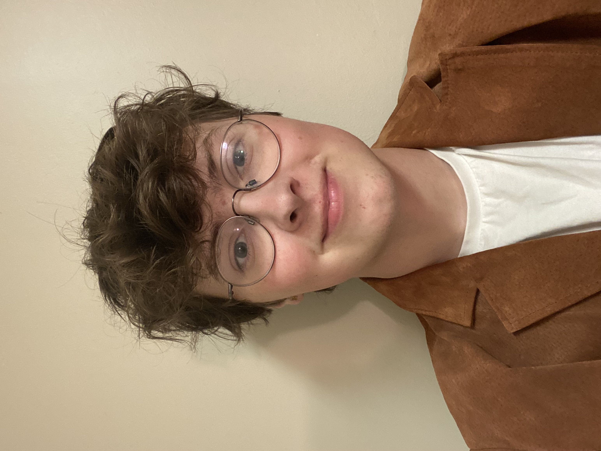
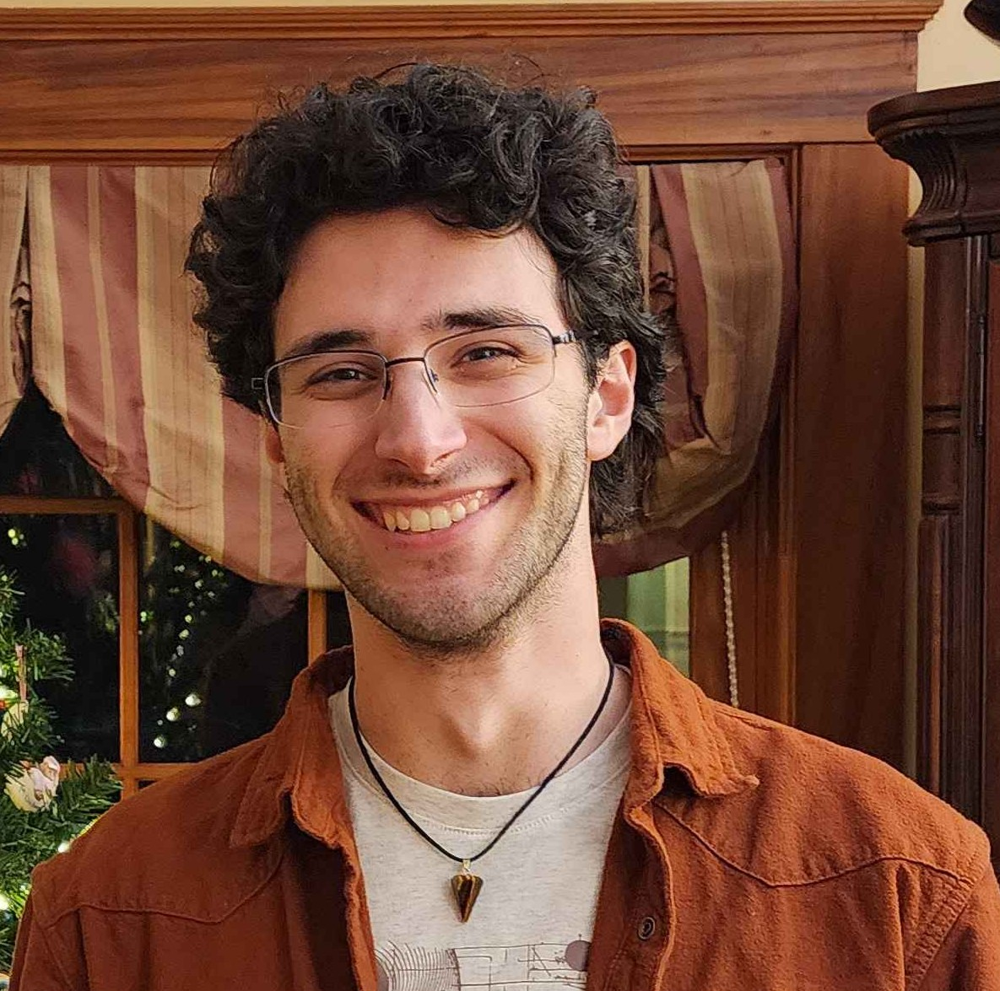
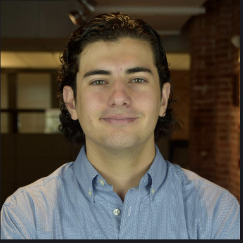
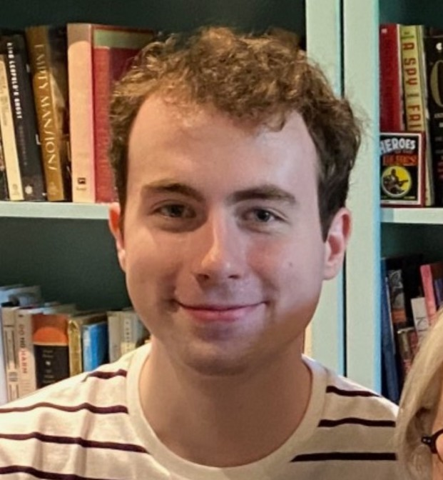

---
# To modify the layout, see https://jekyllrb.com/docs/themes/#overriding-theme-defaults

layout: default
title: About our team
description: A brief introduction to the four students working on this project
show_group_link: false
---

<d1>
<dt><b>Chase Fetherling</b></dt>
<dd>Hello, my name is Chase Fetherling. I am a Computer Science and Philosophy double major, working on a Master's in Computer Science as well. I work mainly with JavaScript, C#, and Python.</dd>
</d1>

<d1>
<dt><b>Samuel Billante</b></dt>
<dd>Hello! I'm Sam Billante, a computer science and economics double major pursuing masters degrees in both those fields. I am passionate about algorithm design and most of my experience is in machine learning and cryptography.</dd>
</d1>

<d1>
<dt><b>Domonic Ullmer</b></dt>
<dd>I am a Computer Science major and MBA student with a concentration in Data Analytics at The University of Alabama, graduating with a B.S. in 2026 and an MBA in 2027 through the university’s selective STEM to MBA Program. This academic path combines technical depth with structured business training and has shaped my ability to work across data, operations, and strategy.</dd>
</d1>

<d1>
<dt><b>Noah Bradley</b></dt>
<dd>Hi, my name is Noah Bradley, and I am from Pittsburgh, Pennsylvania. I am a CS major with an interest in game development and machine learning. I have experience writing in Java, C++, and Python. You can reach me at noah.oli.bradley@gmail.com.</dd>
</d1>